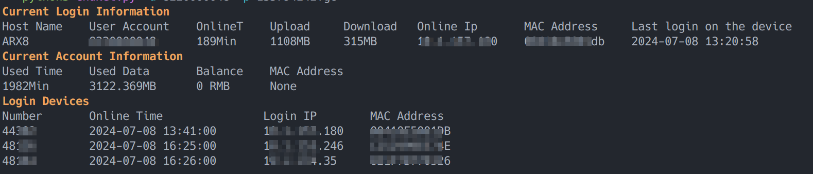

# CNU Campus Network Manager

This project is designed to manage CNU campus network connections, allowing server and terminal users to connect and manage their own campus network accounts.

## TODO

[] Login Out
[] Suport WIFI/WLAN
## Installation

1. Clone the repository:

```bash
git clone https://github.com/Gs-ygc/CNU-Campus-Network-Manager.git
```

2. Change directory to the project folder:

```bash
cd CNU-Campus-Network-Manager
```

3. Install dependencies using `pip` and `requirements.txt`:

```bash
pip install -r requirements.txt
```

## Usage

### Help Command

```BASH
python3 CnuNet.py --help
```

### Example Command

```BASH
python3 CnuNet.py -u 123456 -p PASSWORD
```

## Output



### Current Login Information

```BASH
Host Name    User Account    Online Time    Upload     Download   Online IP       MAC Address     Last Login on the Device 
ARX8         123456      189Min         1108MB     315MB      10.1.157.180    00410e5001db    2024-07-08 13:20:58      
```

### Current Account Information

```BASH
Used Time    Used Data       Balance    MAC Address    
1982Min      3122.369MB      0 RMB      None           
```

### Login Devices

```BASH
Number       Online Time               Login IP        MAC Address    
44302        2024-07-08 13:41:00       10.1.157.180    00410E5001DB   
48136        2024-07-08 16:25:00       10.1.153.246    C252999EE74E   
48164        2024-07-08 16:26:00       10.1.154.35     821F7B770326   
```

## Contributing

Feel free to contribute to this project by submitting pull requests or reporting issues.

## License

This project is licensed under the [MIT License](LICENSE).
